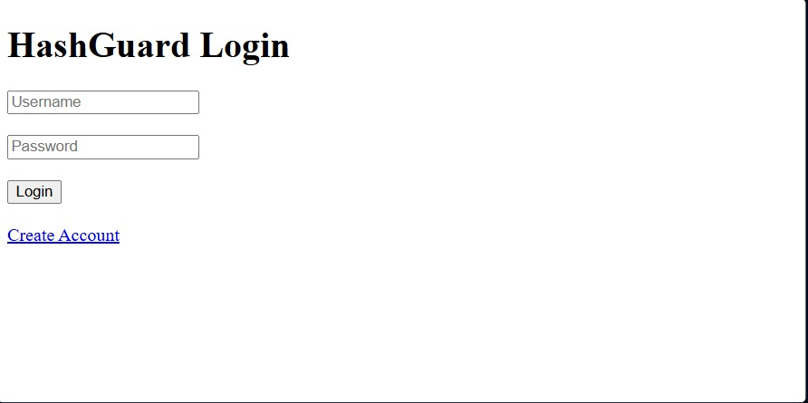
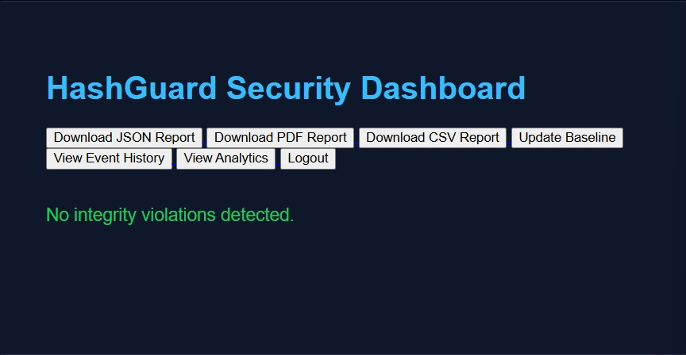
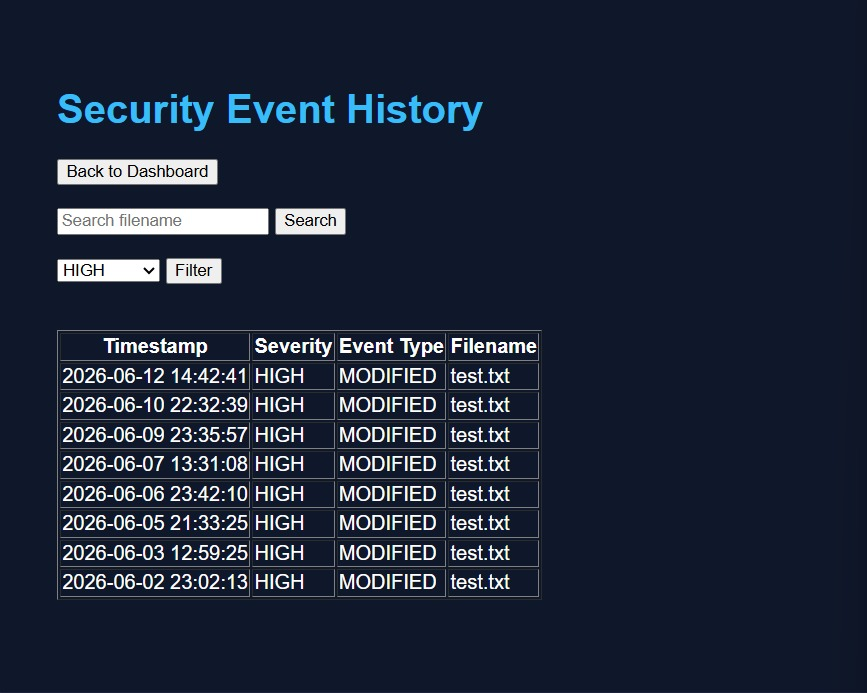
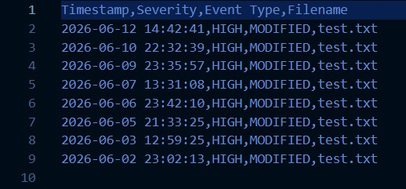
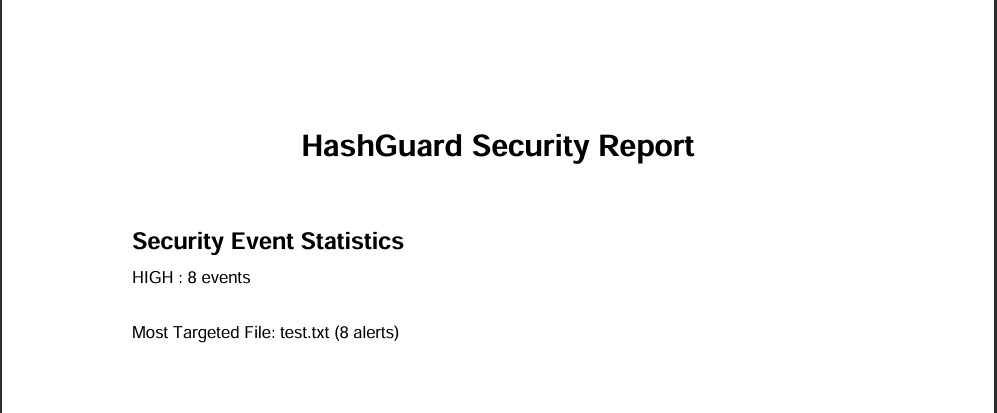

# HashGuard

## File Integrity Monitoring and Security Analytics System

HashGuard is a Flask-based file integrity monitoring system designed to detect unauthorized file modifications, deletions, and additions using SHA-256 hashing.

The system continuously monitors protected files, logs security events, stores incidents in a SQLite database, generates security reports, provides analytics dashboards, and sends email alerts for critical events.

---

## Problem Statement

Organizations and individuals often face unauthorized modifications to sensitive files. Traditional file storage systems may not immediately notify users when files are altered or deleted.

HashGuard addresses this problem by:

* Monitoring file integrity
* Detecting suspicious changes
* Recording security events
* Providing security analytics
* Generating downloadable reports
* Alerting users about critical incidents

---

## Features

### Core Security Features

* SHA-256 file integrity verification
* Baseline hash generation
* Detection of modified files
* Detection of deleted files
* Detection of newly added files

### Monitoring Features

* Continuous monitoring
* Event logging
* Severity classification

### Database Features

* SQLite event storage
* Historical event tracking
* Search functionality
* Severity-based filtering

### Dashboard Features

* Flask web dashboard
* Live alert display
* Event history viewer
* Security analytics dashboard

### Reporting Features

* JSON report generation
* PDF report generation
* CSV report generation
* Downloadable security reports

### Authentication Features

* User registration
* Secure login
* Session management
* Password hashing

### Notification Features

* Email alerts for critical events

---

## System Architecture

```text
                    ┌─────────────────┐
                    │      User       │
                    └────────┬────────┘
                             │
                             ▼
                  ┌────────────────────┐
                  │ Authentication     │
                  │ Login / Register   │
                  └────────┬───────────┘
                           │
                           ▼
                  ┌────────────────────┐
                  │ Flask Dashboard    │
                  └────────┬───────────┘
                           │
       ┌───────────────────┼───────────────────┐
       │                   │                   │
       ▼                   ▼                   ▼

┌──────────────┐  ┌────────────────┐  ┌────────────────┐
│ Integrity    │  │ Analytics      │  │ Report Engine  │
│ Monitor      │  │ Dashboard      │  │ JSON/PDF/CSV   │
└──────┬───────┘  └───────┬────────┘  └────────┬───────┘
       │                  │                    │
       ▼                  ▼                    ▼

┌──────────────┐  ┌────────────────┐  ┌────────────────┐
│ SHA-256      │  │ SQLite         │  │ Downloadable   │
│ Hash Engine  │  │ Database       │  │ Reports        │
└──────┬───────┘  └───────┬────────┘  └────────────────┘
       │                  │
       ▼                  ▼

┌──────────────┐  ┌────────────────┐
│ Watched      │  │ Security       │
│ Files        │  │ Events         │
└──────────────┘  └────────────────┘

                           │
                           ▼

                  ┌────────────────────┐
                  │ Email Alert System │
                  └────────────────────┘
```

---

## Project Structure

```text
HashGuard/
│
├── app.py
│
├── baseline/
│   └── hashes.json
│
├── database/
│   └── security.db
│
├── logs/
│   └── security.log
│
├── reports/
│
├── screenshots/
│   ├── login.jpeg
│   ├── register.jpeg
│   ├── dashboard.jpeg
│   ├── history.jpeg
│   ├── analytics.jpeg
│   ├── csv-report.jpeg
│   └── pdf-report.jpeg
│
├── src/
│   ├── monitor.py
│   ├── hasher.py
│   ├── database.py
│   ├── email_alert.py
│   └── pdf_report.py
│
├── static/
│   └── style.css
│
├── templates/
│   ├── login.html
│   ├── register.html
│   ├── index.html
│   ├── history.html
│   └── analytics.html
│
├── watched/
│
└── README.md
```

---

## Technologies Used

* Python
* Flask
* SQLite
* SHA-256 Hashing
* Werkzeug Password Hashing
* HTML
* CSS
* JSON
* ReportLab

---

## Installation

### Clone Repository

```bash
git clone https://github.com/YOUR_USERNAME/HashGuard.git
```

### Move into Project

```bash
cd HashGuard
```

### Install Dependencies

```bash
pip install flask
pip install reportlab
pip install werkzeug
```

### Run Application

```bash
python app.py
```

---

## Usage

### Create Account

Navigate to:

```text
http://127.0.0.1:5000/register
```

### Login

Navigate to:

```text
http://127.0.0.1:5000/login
```

### Monitor Files

Place files inside:

```text
watched/
```

HashGuard will monitor those files for:

* Modification
* Deletion
* New additions

---

## Screenshots

### Login Page



### Register Page


### Dashboard



### Event History



### Analytics Dashboard


### CSV Export



### PDF Export



---

## Future Enhancements

* Multi-user support
* Role-based access control
* Real-time WebSocket monitoring
* Cloud storage protection
* Mobile notifications
* Threat intelligence integration
* Machine learning anomaly detection

---

## Contributors

HF

---

## License

This project is licensed under the MIT License.
